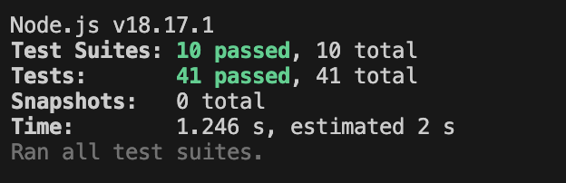
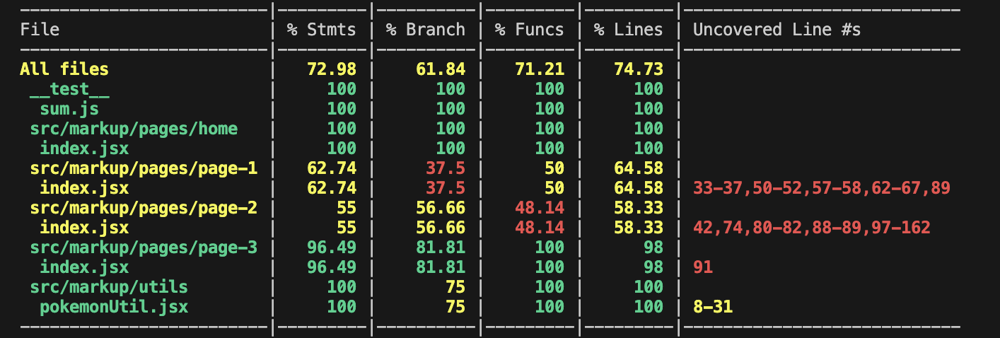
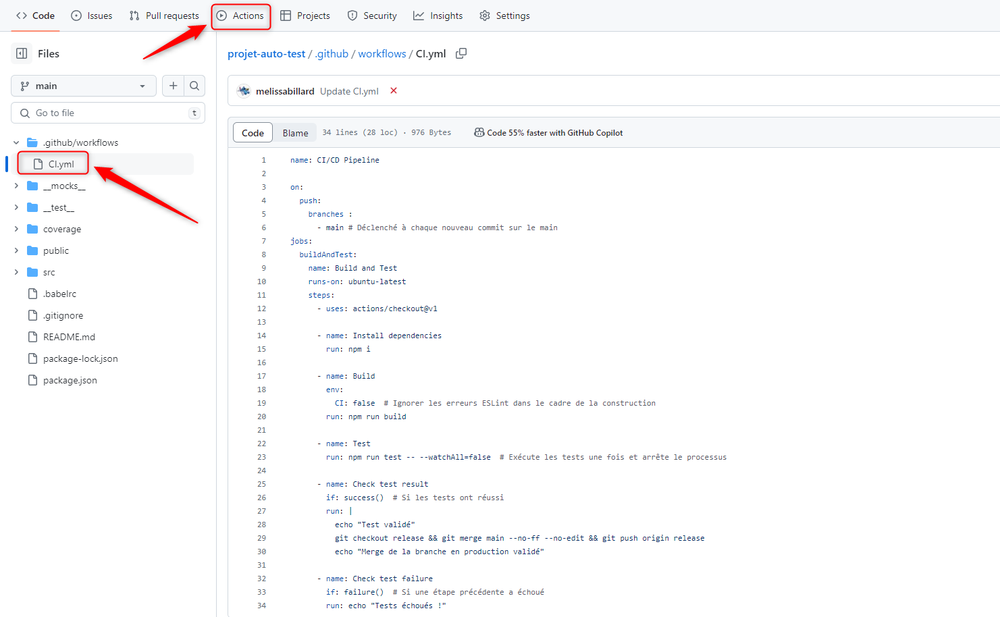
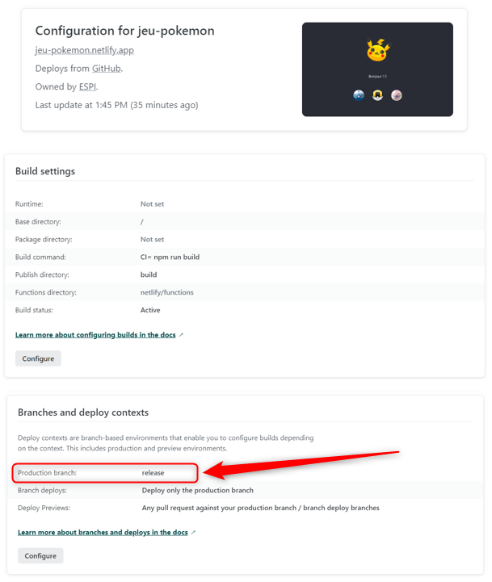

# Projet guidé - Automatisation des tests

## Participants 👥
- BILLARD Mélissa
- BRACCIALES-COMBAS Lola
- CARRILHO LAMEIRA Rita

## Objectifs
L’objectif est de mettre en place un processus de tests automatisés et d’intégration continue.

## API Pokémon ⚡
Webservice : [https://pokeapi.co/](https://pokeapi.co/)

## Technologie 
- Site Web en [React](https://fr.legacy.reactjs.org/)

## Présentation des Tests et Instructions d'Exécution

- [JEST](https://jestjs.io/fr/docs/getting-started)

### Exécuter les tests

**TOTAL** : 41 tests.

1) Test standard : ```npm test```



2) Test avec coverage : ```npm run test:cov```



### Test unitaire

| Libellé                                       | Objectif du Test                                                | Valeur attendue | Fichier                    |
|-----------------------------------------------|-----------------------------------------------------------------|-----------------|----------------------------|
| fetchPokemonImages should fetch and return... | Vérifier que fetchPokemonImages récupère et renvoie les images de pokémon | True          | memory.test.js            |
| shuffleArray should shuffle the array         | Vérifier que shuffleArray mélange correctement le tableau       | True            | memory.test.js            |
| startGame initializes the game correctly      | Vérifier que startGame initialise correctement le jeu           | True            | memory.test.js            |
| handleCardClick updates flipped cards and... | Vérifier que handleCardClick met à jour les cartes retournées et les paires correspondantes correctement | True | memory.test.js          |
| fetches Pokémon options on load               | Vérifier que les options de Pokémon sont récupérées au chargement | True           | Page2.unit.test.js       |
| fetchMoveData fetches move data correctly    | Vérifier que fetchMoveData récupère correctement les données de mouvement | True         | pokemonUtils.test.js     |
| fetchPokemonData fetches Pokémon data...     | Vérifier que fetchPokemonData récupère correctement les données de Pokémon | True         | pokemonUtils.test.js     |
| handles errors when fetching Pokémon data    | Vérifier que les erreurs sont gérées lors de la récupération des données de Pokémon | True        | pokemonUtils.test.js     |
| calculates damage correctly                  | Vérifier que calculateDamage calcule correctement les dégâts   | True            | pokemonUtils.test.js     |
| calculates damage with random factor         | Vérifier que calculateDamage calcule correctement les dégâts avec un facteur aléatoire | True | pokemonUtils.test.js     |

### Test graphique

| Libellé                              | Objectif du Test                                      | Valeur attendue                | Page                | Fichier                    |
|--------------------------------------|-------------------------------------------------------|--------------------------------|---------------------|----------------------------|
| Renders composant Home correctement  | Vérifier le rendu correct du composant Home           | True                           | Home                | home.test.js               |
| A les liens de navigation            | Vérifier la présence et les destinations des liens de navigation | True                | Home                | home.test.js               |
| Vérifier les classes CSS            | Vérifier que les classes CSS sont appliquées correctement | True                        | Home                | home.test.js               |
| Vérifier les styles inline corrects | Vérifier que les styles inline sont correctement appliqués | True                     | Home                | home.test.js               |
| Simuler les interactions des utilisateurs | Vérifier le comportement des interactions utilisateur | True                    | Home                | home.test.js               |
| Le texte "Bonjour" est présent       | Vérifier que le texte "Bonjour" est présent            | True                           | Home                | home.test.js               |
| Le texte "Bonjour" est correct       | Vérifier que le texte "Bonjour" est correctement affiché | True                       | Home                | home.test.js               |
| Le résultat possède 5 caractères     | Vérifier que le résultat a 5 caractères                | False                          | Home                | home.test.js               |
| Renders the game start screen       | Vérifier le rendu de l'écran de démarrage du jeu      | True                           | Page3               | memorygraphic.test.js      |
| Starts the game when the start button is clicked | Vérifier que le jeu démarre lorsque le bouton de démarrage est cliqué | True      | Page3               | memorygraphic.test.js      |
| Flips a card when clicked           | Vérifier qu'une carte est retournée lorsqu'elle est cliquée | True                     | Page3               | memorygraphic.test.js      |
| Renders composant Page1 correctement | Vérifier le rendu correct du composant Page1         | True                           | Page1               | page1.test.js              |
| A les liens de navigation            | Vérifier la présence et les destinations des liens de navigation | True                | Page1               | page1.test.js              |
| Vérifier les classes CSS            | Vérifier que les classes CSS sont appliquées correctement | True                        | Page1               | page1.test.js              |
| Vérifier les styles inline corrects | Vérifier que les styles inline sont correctement appliqués | True                     | Page1               | page1.test.js              |
| Simuler les interactions des utilisateurs | Vérifier le comportement des interactions utilisateur | True                    | Page1               | page1.test.js              |
| Le texte "What type is pokemon1?" est présent | Vérifier que le texte "What type is pokemon1?" est présent | True               | Page1               | page1.test.js              |
| Les options de type de Pokémon sont affichées | Vérifier que les options de type de Pokémon sont affichées | True                | Page1               | page1.test.js              |
| Les options de type de Pokémon sont correctes | Vérifier que les options de type de Pokémon correspondent aux données de test | True | Page1               | page1.test.js              |
| Le clic sur une option affiche le message correct | Vérifier que le clic sur une option affiche le message correct | True              | Page1               | page1.test.js              |
| Le clic sur la question suivante met à jour la question | Vérifier que le clic sur la question suivante met à jour la question | True         | Page1               | page1.test.js              |

### Test d'intégration

| Libellé                              | Objectif du Test                                      | Valeur attendue                | Page                | Fichier                    |
|--------------------------------------|-------------------------------------------------------|--------------------------------|---------------------|----------------------------|
| Test API 200                         | Vérifier que l'API retourne un statut 200             | True                           | -                   | api.test.js                |
| Test API 404                         | Vérifier que l'API retourne un statut 404             | True                           | -                   | api.test.js                |
| Récupération des données d'un Pokémon| Vérifier la structure des données retournées par l'API| True                           | -                   | api.test.js                |
| Fetch Pokémon Data                   | Vérifier que les données du Pokémon sont récupérées avec succès | True                   | -                   | apiMocks.test.js           |
| Handle 404 Error                     | Vérifier que l'API gère correctement une erreur 404   | True                           | -                   | apiMocks.test.js           |
| Retrieve Pokémon Data Structure      | Vérifier la structure des données du Pokémon retournées par l'API | True                   | -                   | apiMocks.test.js           |
| Navigate from Home to Page2          | Vérifier la navigation de la page Home à la page Page2 | True                           | Home                | navigation.test.js         |
| Navigate from Page1 to Home          | Vérifier la navigation de la page Page1 à la page Home| True                           | Page1               | navigation.test.js         |

## Intégration continue
Nous avons mis en place un pipeline d'intégration continue (CI) avec GitHub Actions, qui surveille les commits sur la branche principale (main), exécute automatiquement les tests, et fusionne le code sur la branche de production (release) si les tests réussissent, garantissant ainsi une base de code stable et prête pour le déploiement.



## Hébergement et cloud computing
- [Netlify](https://www.netlify.com/)

**Lien d'accès :** [https://jeu-pokemon.netlify.app/](https://jeu-pokemon.netlify.app/)

## Déploiement continu
Pour le déploiement continu, si aucune erreur n'est détectée dans le commit de la branche `release` envoyé à Netlify (deuxième vérification), alors le commit sera poussé en production.




